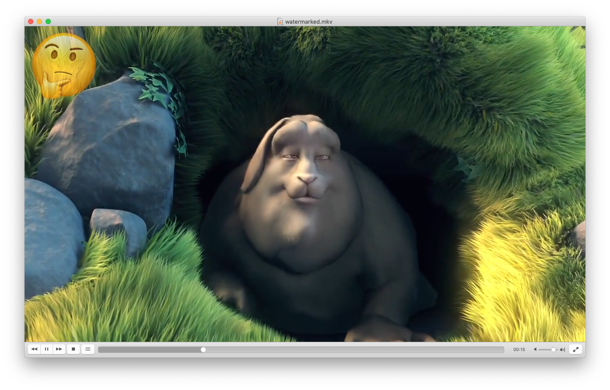

# Streaming Demos

This repository contains three streaming demos all focused around video processing.  All the demos below will
assume you have a video file locally that you would like to process.  I used the [Big Buck
Bunny](https://peach.blender.org/about/) movie from the [Blender Foundation](www.blender.org).  You may use
whatever video you'd like assuming its in a supported format for the APK released ffmpeg.

The bash-streaming template I'm using here is from https://github.com/alexellis/openfaas-streaming-templates

## Preview

Preview is a function that generates a quick 15s webm preview of the video you provide. It is a great use
case for streaming because ffmpeg will finish processing once its reached 15s of video and will terminate the
connection before the entire video has even been received.

```bash
faas up -f preview.yml --build-arg ADDITIONAL_PKG="ffmpeg"

curl -SLsfv http://$GATEWAY/function/preview --data-binary @$VIDEO_PATH > preview.webm
```

## Contact-Sheet

Generates a [contact-sheet](https://en.wikipedia.org/wiki/Contact_print) from the provided video.  This uses ffmpeg to generate a keyframe thumbnail every
1m of video and then they are put together into a collage using imagemagick's montage tool.

The size of the resulting image scales directly with the length of the video you pipe in.
```bash
faas up -f contact-sheet.yml --build-arg ADDITIONAL_PKG="ffmpeg imagemagick"

curl -SLsfv http://$GATEWAY/function/contact-sheet --data-binary @$VIDEO_PATH > contact_sheet.png
```


## Watermark

Re-encodes the video with the provided image as a watermark in the upper left corner of the video. We're
using [this technique with ffmpeg](http://ksloan.net/watermarking-videos-from-the-command-line-using-ffmpeg-filters/)  In this
example we're using the CGI Environment Variables injected by the `of-watchdog` to allow arguments to be passed in to the script.

There are two query params that can be passed:
`opacity`: [0.0-1.0] sets the opacity of the watermark, defaults to 0.7
`image`: URL to the image asset to use, defaults to "https://avatars2.githubusercontent.com/u/27013154?s=50&v=4"

```bash
faas up -f watermark.yml --build-arg ADDITIONAL_PKG="ffmpeg"

curl -SLsfv http://$GATEWAY/function/watermark?opacity=0.5&image=https://emojipedia-us.s3.dualstack.us-west-1.amazonaws.com/thumbs/240/apple/198/thinking-face_1f914.png --data-binary @$VIDEO_PATH > watermarked.mkv
```

Will result in a thinking face overlaid as a watermark on your video.


### Note on Timeouts
Because video processing can take a while, you might need to increase some settings on your gateway to allow long running connections.  For my demo processing [BigBuckBunny](https://peach.blender.org/about/) I set the following for my gateway:

 • readTiemout=305s
 • writeTimeout=305s
 • upstreamTimeout=300s


### Note on mkv format
Because I am streaming the result video I'm using a container that does not require end of write metadata.  I
am using the Matroska container format for the response, however the codec used *should* be the same as the
input provided for all use cases except `Preview`
